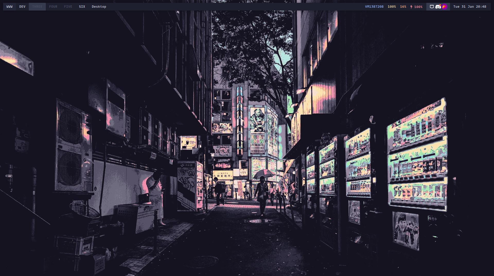

# Dotfiles
## What I use
- Qtile (window manager)
- Dunst (notification manager)
- Eww (widgets)
- Alacritty (shell)
- Picom (compositor)
- VS Code (editor)
- Fish (shell)
- SDDM (display manager)
  - sugar-candy (theme)

## Tools
- [Bat](https://github.com/sharkdp/bat)
- [Btop](https://github.com/aristocratos/btop)
- [Bottom](https://github.com/ClementTsang/bottom)

## Images


## Usage
[Chezmoi](https://www.chezmoi.io/) is used to manage the dotfiles

```sh
# Arch
pacman -S chezmoi
# Windows
scoop install chezmoi
```

**Note:** Config files located in `etc` and `usr` are **not** managed by chezmoi and must be manually copied over to their respective locations. They also must be manually copied back in after modifications

## Todo
- [ ] **ADD ALL DEPENDENCIES TO A LIST**
- [ ] System dashboard widget
  - [ ] System controls i.e. volume/brightness
  - [ ] Calender
- [ ] Notification daemon
  - [ ] Battery alerts
- [ ] Improve top bar
  - [ ] Spotify/audio controls
  - [ ] Cleaner systray  
- [ ] Proper screenshotting tool
- [ ] Bluetooth
- [ ] Cleaner fish prompt
- [ ] Blurring background when window showing
- [ ] Improve layouts, possible multi window layout with easy focus/full-screening
- [ ] Dedicated image and video
- [ ] Dedicated pdf viewer
- [ ] Improve fish aliasing and keybinds