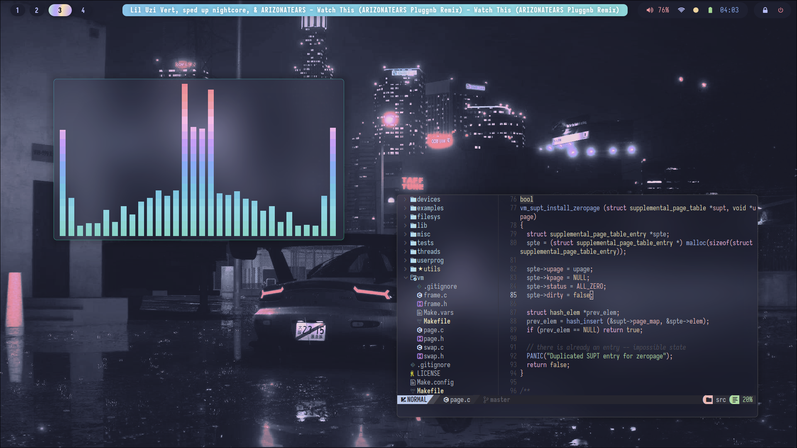

<div align="center">

```ocaml
🥶 Dripfiles
```




<div align="left">

---


<fnzc>
<b>My dotfiles for my linux, windows and wsl environments</b>
</samp>

<br />

> 🧊 Tool specific documentation are in their respective subdirectories

---
## <samp> Setup <samp>

These dotfiles are managed by [`dotdrop`](https://github.com/deadc0de6/dotdrop). Its configuration file is `config.yaml`, profiles include relevant configuration files for their respective environments
### <samp><kbd>I.</kbd> [Install](https://dotdrop.readthedocs.io/en/latest/installation)
```bash
# Arch (AUR)
$ yay -S dotdrop
# Debian / Ubuntu
$ sudo apt install dotdrop
# Windows
$ pip3 install dotdrop --user
# Additional step for WSL
$ pip install python-magic-bin
```

### <samp><kbd>II.</kbd> Apply
Choose the profile that makes sense for your environment or define a new one
```bash
$ dotdrop install -p <profile>
```
---
## <samp> Features </samp>
> 🏗️ Incomplete list

- [ ] Hyprland
    - [ ] Keybinds
    - [ ] Window rules
    - [ ] Documentation
- [ ] Status Bar
- [ ] Control Panel
- [ ] Fish
- [x] Alacritty <kbd style="background-color:#a6e3a144;color:#cdd6f4;border:1px solid #a6e3a1;border-radius:30px;padding:1px 3px;margin: 0 0 2px 5px">complete</kbd>
- [x] Locking & Powermenu <kbd style="background-color:#a6e3a144;color:#cdd6f4;border:1px solid #a6e3a1;border-radius:30px;padding:1px 3px;margin: 0 0 2px 5px">complete</kbd>
- [x] Wofi <kbd style="background-color:#a6e3a144;color:#cdd6f4;border:1px solid #a6e3a1;border-radius:30px;padding:1px 3px;margin: 0 0 2px 5px">complete</kbd>
- [x] Clipboard management <kbd style="background-color:#a6e3a144;color:#cdd6f4;border:1px solid #a6e3a1;border-radius:30px;padding:1px 3px;margin: 0 0 2px 5px">complete</kbd>
- [x] Screenshot utilities <kbd style="background-color:#a6e3a144;color:#cdd6f4;border:1px solid #a6e3a1;border-radius:30px;padding:1px 3px;margin: 0 0 2px 5px">complete</kbd>
- [x] Neovim <kbd style="background-color:#a6e3a144;color:#cdd6f4;border:1px solid #a6e3a1;border-radius:30px;padding:1px 3px;margin: 0 0 2px 5px">complete</kbd>
