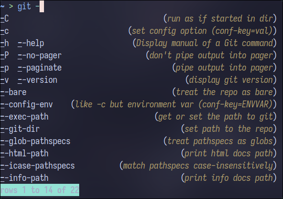

<div align='center'>
    <h1><a href="https://fishshell.com">Fish</a> Shell</h1>
    
</div>
<div align='left'>
<br />

## Installation
### Arch
```console
sudo pacman -S fish
```
### [Ubuntu](https://launchpad.net/~fish-shell/+archive/ubuntu/release-3)
```console
sudo apt-add-repository ppa:fish-shell/release-3
sudo apt update
sudo apt install fish
```

Copy dotfiles to `$HOME/.config/fish` and `fisher update`
---

## Package Manager `->` [Fisher](https://github.com/jorgebucaran/fisher)
### Installation
```console
curl -sL https://raw.githubusercontent.com/jorgebucaran/fisher/main/functions/fisher.fish | source && fisher install jorgebucaran/fisher
```
### Usage
- `fisher install ... ->` Install a package
- `fisher list ->` List all installed packages
- `fisher update [...] ->` Update all or specific package
- `fisher remove ... ->` Remove package
---
## Prompt `->` [Tide](https://github.com/IlanCosman/tide)
## **Not in use due to slow startup on WSL**
### Installation
```console
fisher install IlanCosman/tide@v5
```
### Usage
- `tide configure ->` Reconfigure prompt
### Image


## Prompt `->` [Hydro](https://github.com/jorgebucaran/hydro)
### Installation
```console
fisher install jorgebucaran/hydro
```
### Configuration
In `config.fish`
### Image


# Plugins

## [Puffer-fish](https://github.com/nickeb96/puffer-fish)
> Text expansions for fish
### Installation
```console
fisher install nickeb96/puffer-fish
```
### Usage
```
!!           -> Expands to last command
.'s after .. -> Expand to /..
!$           -> Expands to last argument
```
---
## [Z](https://github.com/jethrokuan/z)
> Directory jumping
### Installation
```console
fisher install jethrokuan/z
```
### Usage
- `z ... ->` Jump to directory
- `zo ... ->` Open explorer at directory
---
## [fnm](https://github.com/Schniz/fnm)
> Node version manager
### Installation
```console
curl -fsSL https://fnm.vercel.app/install | bash
```
### Usage
- `fnm use ... ->` Switch to a node version
- `fnm install ... ->` Install a node version
- `fnm list ->` List installed versions
---
## [fzf](https://github.com/PatrickF1/fzf.fish)
> Fzf integration for fish
### Installation
```console
fisher install PatrickF1/fzf.fish
```
### Requirements
- `fd`
- `bat`
### Usage
- `Ctrl + R ->` Search command history
- `Ctrl + Alt + F ->` Search directory
- `Ctrl + Alt + L ->` Search git log
- `Ctrl + Alt + S ->` Search git status
- `Ctrl + Alt + P ->` Search processes
- `fzf_configure_bindings --help ->` Change keybindings